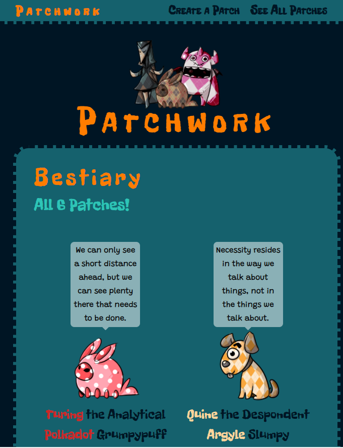
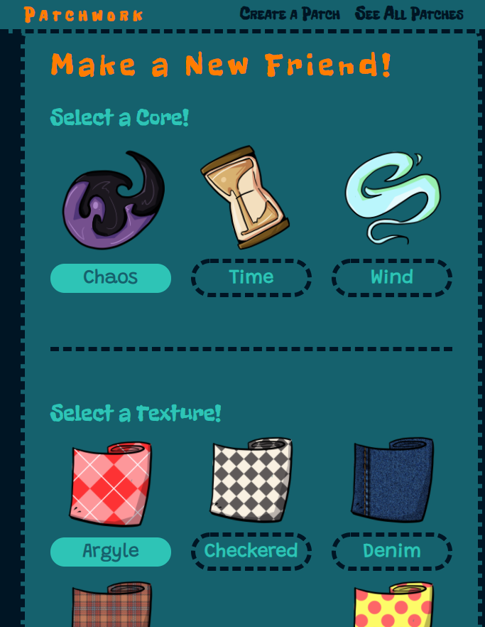
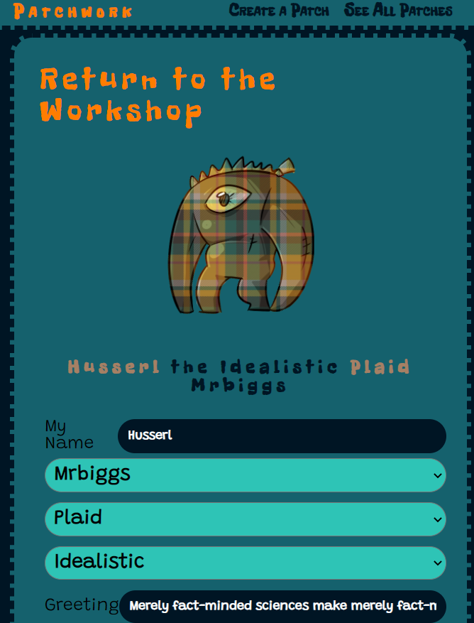

# PATCHWORK
### Back End Tutorial (Java + Spring)
#### [Patchwork Front End](https://github.com/themarkfullton/patchwork-front-end) (React)

Threw this together to show a student how a Java + Spring backend would work. (In comparison to MERN.) 

Backend for an adoptables / pet website where users can build their own Frankenstein "monsters."

## Technologies Used

- Java (Spring)
- MongoDB

## Screenshots

